# Finance Tracker

A modern, full-featured personal finance management application built with Next.js 14, React, and Supabase.


## Features

- **Dashboard** - Get a comprehensive overview of your financial health
- **Expense Tracking** - Log and categorize all your expenses
- **Budget Management** - Set and monitor budgets by category
- **Savings Goals** - Track progress towards your financial goals
- **Reports & Analytics** - Visualize spending patterns with interactive charts
- **AI Insights** - Get intelligent recommendations for better financial decisions
- **Dark/Light Mode** - Beautiful UI that adapts to your preference

## Screenshots

### Landing Page

| Hero Section | Features | Call to Action |
|--------------|----------|----------------|
|  | 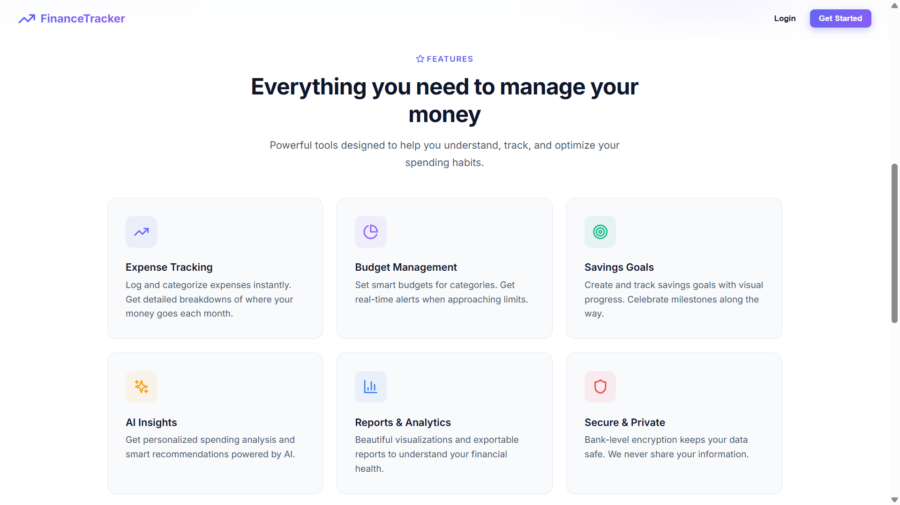 | 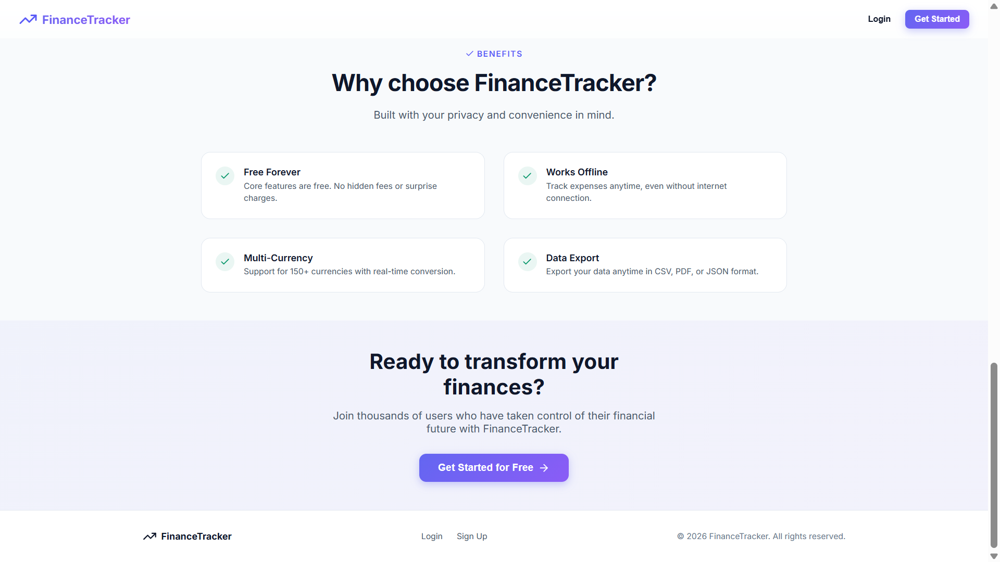 |

### Dashboard

| Overview | Detailed Stats |
|----------|----------------|
| 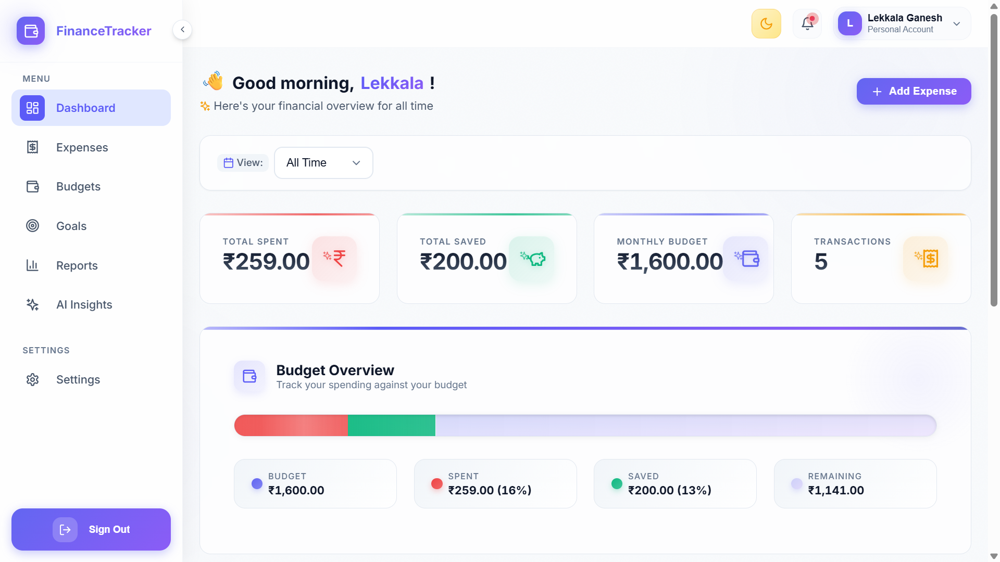 | 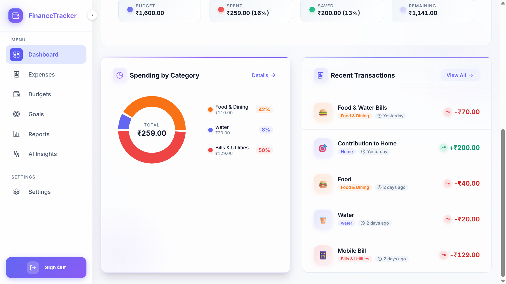 |

### Expense Management

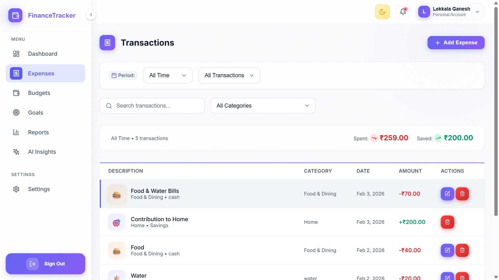

### Budget Tracking

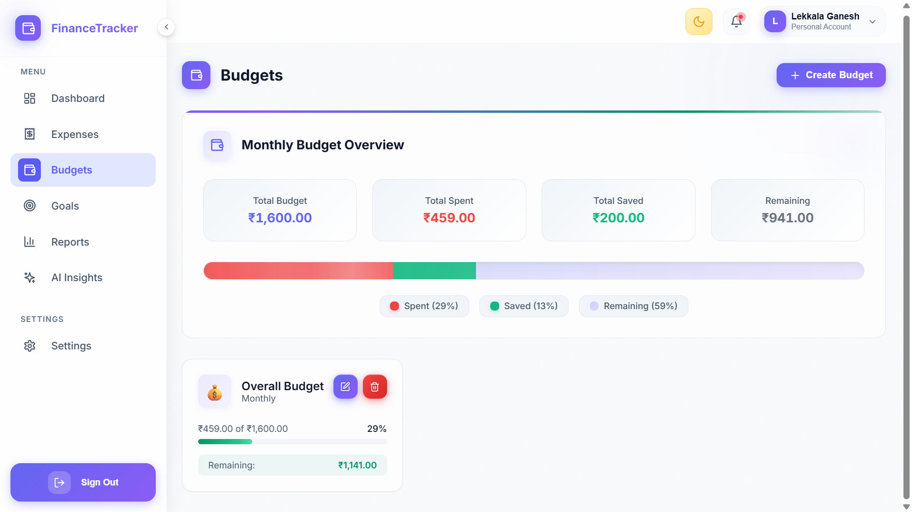

### Savings Goals

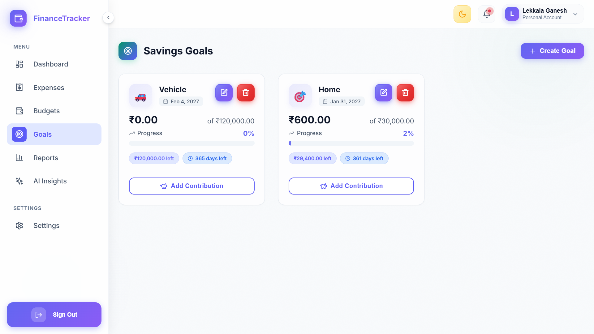

### Reports & Analytics

| Spending Analysis | Detailed Reports |
|-------------------|------------------|
| 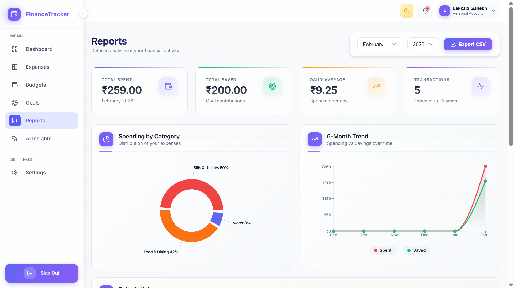 | 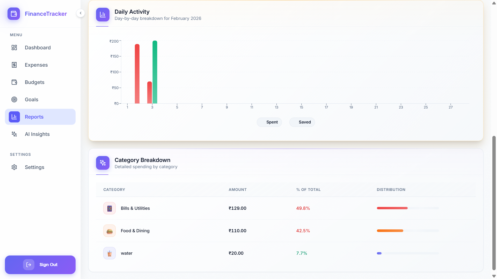 |

### AI-Powered Insights

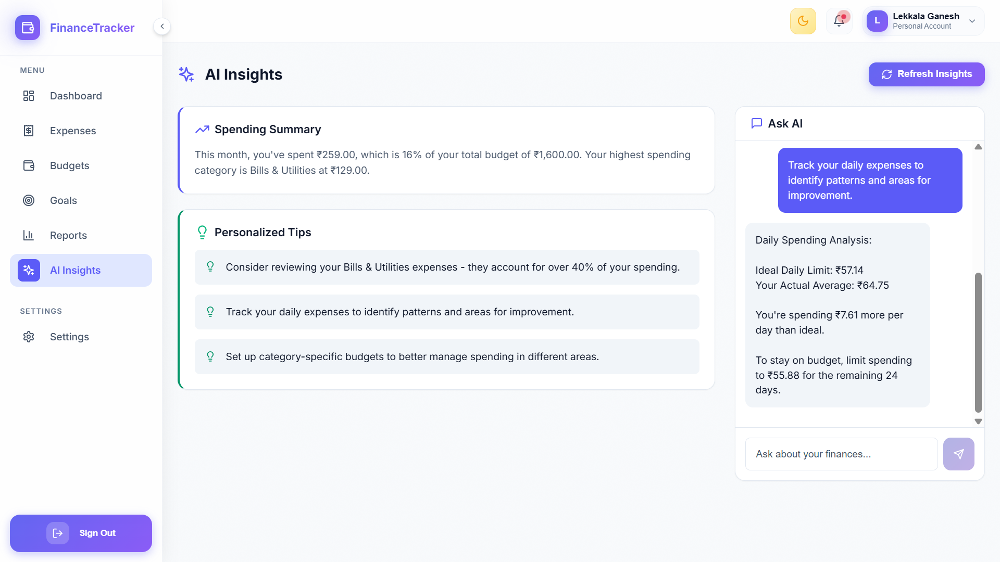

### Settings

| Preferences | Categories |
|-------------|------------|
| 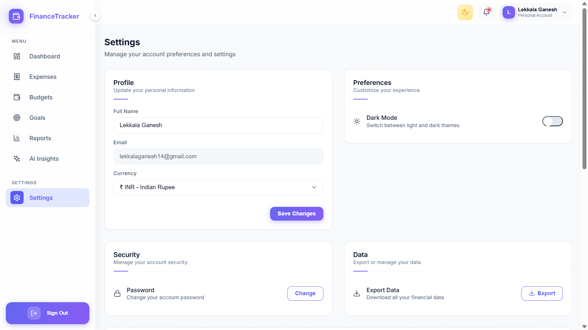 | 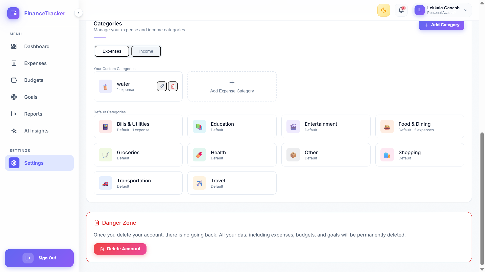 |

## Tech Stack

| Category | Technology |
|----------|------------|
| **Framework** | Next.js 14 (App Router) |
| **Language** | TypeScript |
| **Styling** | Styled Components |
| **Database** | Supabase (PostgreSQL) |
| **Authentication** | Supabase Auth |
| **Charts** | Recharts |
| **Forms** | React Hook Form + Zod |
| **Icons** | Lucide React |

## Performance

This project has been optimized for fast development and production performance:

| Metric | Value |
|--------|-------|
| Dev Server Startup | **2.2s** (Turbopack) |
| Hot Reload (HMR) | **~100ms** |
| Lighthouse Score | 90+ |

See [Performance Optimization Report](docs/PERFORMANCE_OPTIMIZATION.md) for detailed analysis.

## Getting Started

### Prerequisites

- Node.js 18+
- npm or yarn
- Supabase account

### Installation

```bash
# Clone the repository
git clone https://github.com/yourusername/finance-tracker.git

# Navigate to frontend
cd finance-tracker/frontend

# Install dependencies
npm install

# Set up environment variables
cp .env.example .env.local
# Edit .env.local with your Supabase credentials

# Run development server
npm run dev
```

### Available Scripts

```bash
npm run dev          # Start dev server with Turbopack (fast)
npm run dev:webpack  # Start dev server with Webpack
npm run build        # Production build
npm run build:analyze # Analyze bundle size
npm run start        # Start production server
npm run lint         # Run ESLint
npm run test         # Run tests
```

## Project Structure

```
src/
├── app/                    # Next.js App Router pages
│   ├── (auth)/            # Authentication pages
│   ├── (dashboard)/       # Protected dashboard pages
│   └── layout.tsx         # Root layout
├── components/            # React components
│   ├── dashboard/         # Dashboard-specific components
│   ├── layout/            # Layout components
│   ├── onboarding/        # Onboarding flow
│   └── ui/                # Reusable UI components
├── context/               # React Context providers
├── lib/                   # Utilities and configurations
│   └── supabase/          # Supabase client setup
└── types/                 # TypeScript type definitions
```

## Environment Variables

```env
NEXT_PUBLIC_SUPABASE_URL=your_supabase_url
NEXT_PUBLIC_SUPABASE_ANON_KEY=your_supabase_anon_key
```

## Contributing

1. Fork the repository
2. Create your feature branch (`git checkout -b feature/amazing-feature`)
3. Commit your changes (`git commit -m 'Add some amazing feature'`)
4. Push to the branch (`git push origin feature/amazing-feature`)
5. Open a Pull Request

## License

This project is licensed under the MIT License - see the [LICENSE](LICENSE) file for details.

---

Built with Next.js and Supabase
